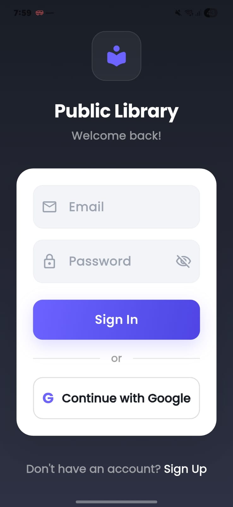
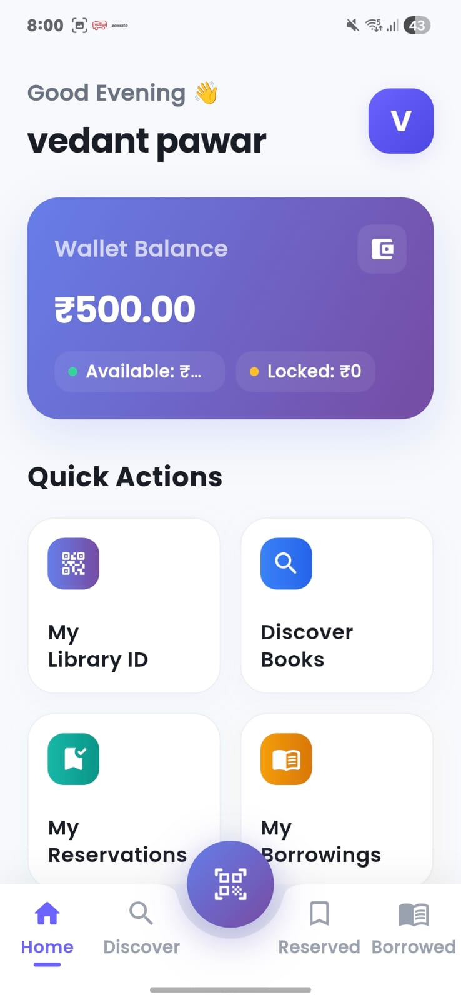

# 📚 Library Management App

A modern Library Management System built with **Flutter + Firebase** for managing books, users, borrowing, reservations, and wallet-based fines.

---

## 🚀 Features

### 👤 User
- Email & Google Authentication
- Digital Library ID (QR)
- Browse & reserve books
- Borrow & return books
- Wallet balance tracking
- Borrow history & fine management

### 🛠 Admin
- Add / Edit / Delete books
- Manage users
- QR-based user scanning
- Borrow & return control
- Overdue tracking
- Analytics dashboard
- Financial summary (Total Wallet Balance)

---

## 📱 Screenshots

### Login


### User Dashboard


### Admin Dashboard


---

## 🏗 Tech Stack
- Flutter
- Provider (State Management)
- Firebase Authentication
- Cloud Firestore
- Firebase Cloud Functions

---

## ⚙️ Setup

```bash
git clone https://github.com/vedant990-hub/library-management-app.git
cd library-management-app
flutter pub get
flutter run

Build release APK:

flutter build apk --release
👨‍💻 Author

Vedant Pawar
https://github.com/vedant990-hub


---

Now run:

```bash
git add README.md
git commit -m "Simplified README"
git push